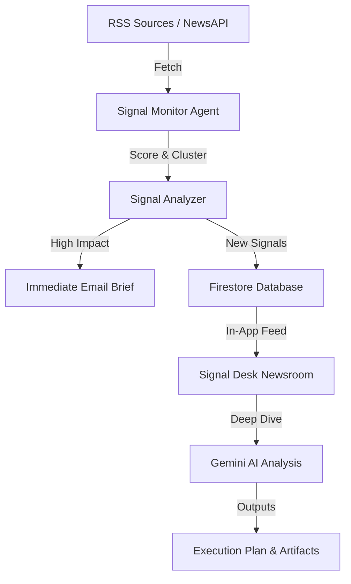

<div align="center">


# ⚡ Signal to Startup

**Turn market signals into startup opportunities — powered by Gemini AI**

[](https://opensource.org/licenses/MIT)
[](https://nextjs.org/)
[](https://firebase.google.com/)

</div>

Signal to Startup is an AI-driven platform that monitors global market shifts, policy changes, and technology trends to surface actionable startup ideas, problem statements, and execution plans.

---

## 🗞️ Key Features

### 1. **Newsroom Signal Desk**
- **Feed Mode**: Browse live, scored news signals across AI, Policy, Markets, and more.
- **Paste Mode**: Drop any article or trend snippet for instant deep-dive analysis.
- **Signal Strength**: 60-100 scoring based on source authority and market relevance.

### 2. **Trend Intelligence Agent**
- **Clustering**: Automatically identifies when multiple reports point to the same emerging trend.
- **Opportunity Grid**: Surfaces "ROI-focused", "Fast-to-Market", and "Urgent" opportunities.
- **Execution Roadmap**: Generates step-by-step launch plans for any identified opportunity.

### 3. **Automated Briefings**
- **Daily Brief**: A curated "missed signals" summary appearing directly in-app.
- **Strong Signal Alerts**: Immediate email notifications (via Resend) when a high-impact (Score > 85) or clustered trend is detected.
- **Signal Monitor**: CRON-ready background agent that fetches, scores, and notifies users of new opportunities.

---

## 🏗️ Architecture



---

## 🚀 Setup & Installation

### 1. Prerequisites
- **Node.js** v18+
- **Google Gemini API Key** (AI Studio)
- **Firebase Project** (Auth + Firestore)
- **Resend API Key** (for automated briefings)

### 2. Installation
```bash
git clone https://github.com/your-username/signal-to-startup.git
cd signal-to-startup
npm install
```

### 3. Environment Configuration
Create `.env.local`:
```env
# AI & APIs
GEMINI_API_KEY=your_gemini_key
RESEND_API_KEY=your_resend_key
NEWS_API_KEY=your_newsapi_key

# App & Auth
APP_URL=http://localhost:3000
CRON_SECRET=your_secure_secret
```

### 4. Background Agents (CRON)
Configure your deployment provider (e.g., Vercel) to trigger these endpoints:
- `GET /api/agent/monitor`: Runs every 4-6 hours to fetch and score new signals.
- `GET /api/agent/digest`: Runs daily to send the summary digest.

---

## 🛠️ Tech Stack

- **Framework:** Next.js 15 (App Router)
- **AI:** Google Gemini 1.5 Pro / Flash
- **Database:** Firebase Firestore
- **Authentication:** Firebase Auth (Google)
- **Email:** Resend
- **Styling:** Vanilla CSS + Framer Motion
- **Tooling:** TypeScript, `fast-xml-parser`

---

## 📝 License
MIT © [Your Name/Company]
